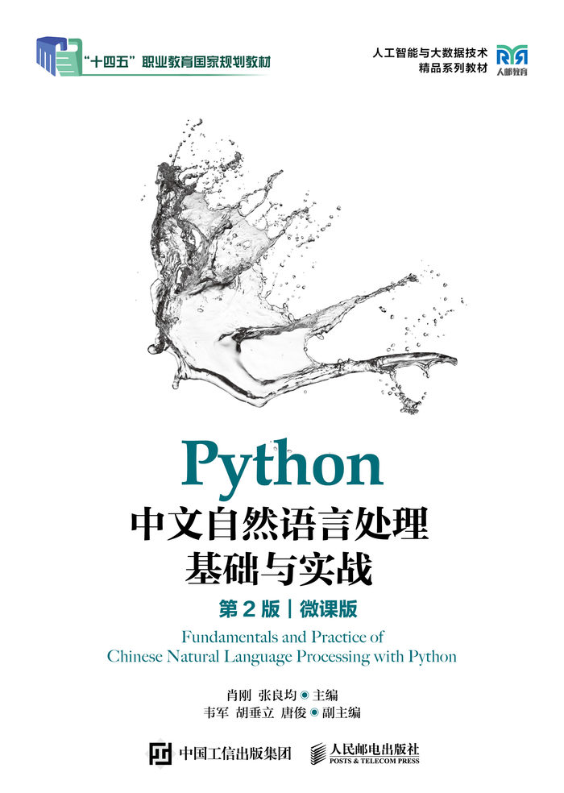

## 《Python中文自然语言处理基础与实战（第2版）》

#### 第1章 绪论
#### 第2章 语料库
#### 第3章 正则表达式
#### 第4章 中文分词
#### 第5章 词性标注和命名实体识别
#### 第6章 关键词提取
#### 第7章 文本向量化
#### 第8章 文本分类和文本聚类
#### 第9章 文本情感分析
#### 第10章 NLP中的深度学习技术
#### 第11章 智能问答系统
#### 第12章 大语言模型
#### 第13章 基于TipDM大数据挖掘建模平台实现垃圾短信分类
